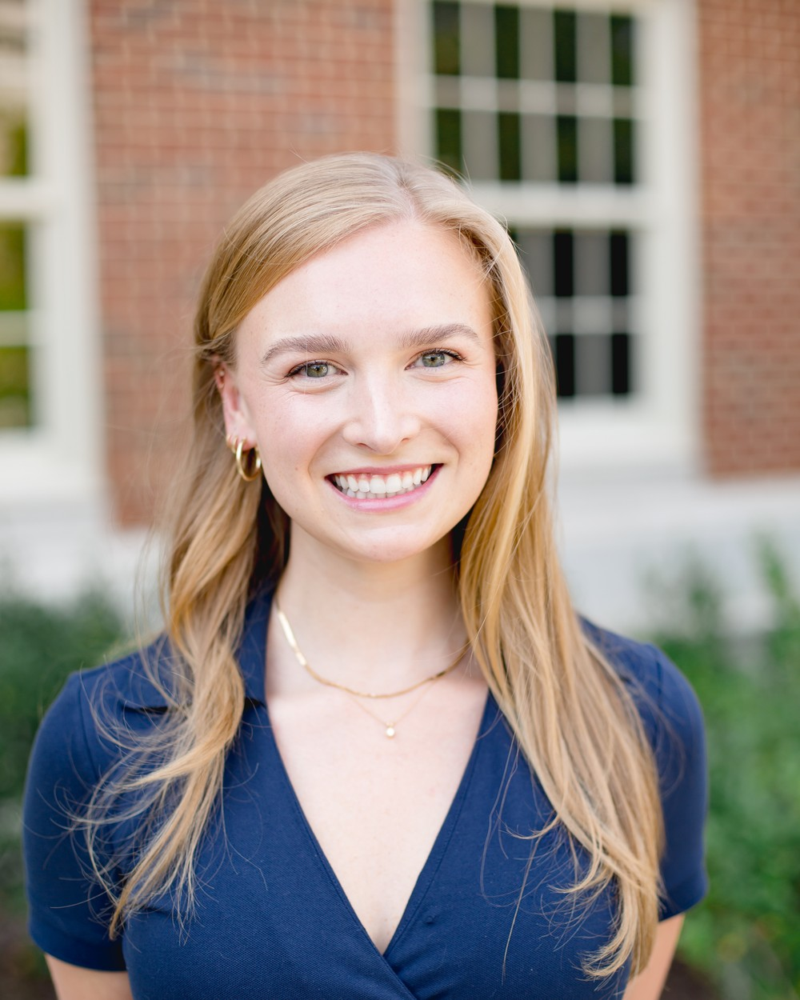

::: {.hero}
{fig-alt="Emma Kate Henry"}

::: {}

Emma Kate Henry

Ph.D. Candidate in Economics Culverhouse College of Business, University of Alabama

I develop **nonparametric and semiparametric methods for panel data**, with a focus on
correlated random effects models that let researchers work with longitudinal data without
committing to a functional form for how unobserved heterogeneity relates to the covariates.
I apply these methods to questions in **innovation and firm dynamics**.
:::
:::

::: {.jm-banner}
**On the 2026–27 academic job market.** I am available for interviews at the ASSA meetings and
by video. See my [job market paper](research.qmd#jmp) or
[download my CV]().
:::

## Research interests

**Primary:** Econometric theory — panel data, nonparametric and semiparametric estimation,
correlated random effects, interactive fixed effects.

**Secondary:** Applied microeconomics — innovation, R&D and firm productivity; experimental
economics.

## Dissertation

*Nonparametric and Semiparametric Correlated Random Effects Models*

My dissertation has three chapters, each relaxing a functional-form assumption that standard
panel estimators impose on unobserved heterogeneity. The first develops estimation and
inference for nonparametric panel models under a Mundlak-type correlated random effects
specification. The second extends correlated random effects to nonlinear panel models, replacing
the usual parametric device with a nonparametric one so that structural parameters stay
consistent when the relationship between individual effects and covariates is unknown. The
third — my [job market paper](research.qmd#jmp) — brings semiparametric estimation to panel
models with **interactive fixed effects**, and applies it to innovation activity.

Committee: Daniel J. Henderson (chair), Soroush Ghazi, Robert Hammond, Alexandra Soberón,
and Emmanuel Tsyawo.

## Education

**Ph.D., Economics** — University of Alabamaexpected 2027

**M.A., Economics** — University of Alabama, Accelerated Master's Program2022

**B.S., Economics** — University of Alabama, *summa cum laude*2022

## Awards and honors

Graduate Council Fellow, Graduate School, University of Alabama2022 – present

Outstanding Teaching by a Doctoral Student, Culverhouse College of Business2026

Three Minute Thesis (3MT) Competition, University of Alabama — **First Place**2025

Harold Elder Teaching Award, Best Economics Graduate Student2025

Departmental Summer Research Grant2025, 2026

President, Economics, Finance & Legal Studies Doctoral Students Organization2024 – present

Department Chair's Award2022

Helms' Scholar Award2022

Murray Havens Economics Award2022

## Contact

**Email** &nbsp; [ekhenry@crimson.ua.edu](mailto:ekhenry@crimson.ua.edu)

Department of Economics, Finance & Legal Studies 
Culverhouse College of Business, University of Alabama 
Tuscaloosa, AL 35487

<!-- NOTE(lily): I deliberately left your phone number off the site even though it's on
     your CV. A public web page is a different exposure than a PDF you send to search
     committees. Add it here if you'd rather have it. -->

<!-- TODO(lily): add your office number/building if you want it listed. -->
