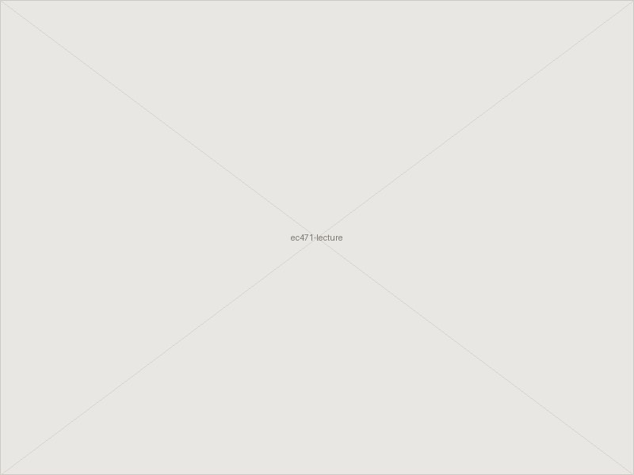
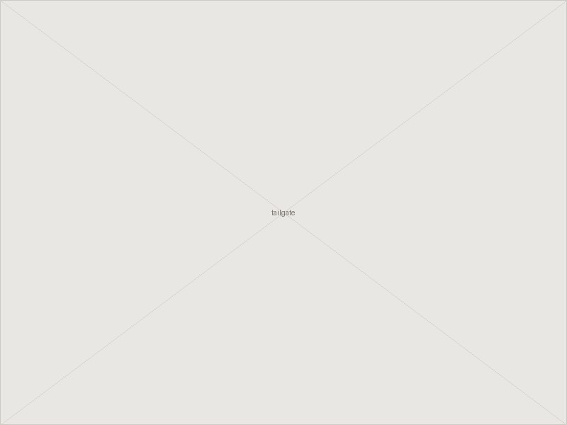
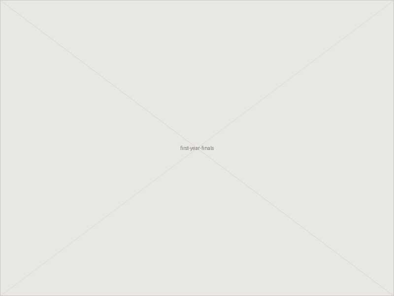

Outside of research and teaching, most of what follows is football, travel, and the
department's own small traditions.

<!-- TODO(lily): rewrite the sentence above in your own voice whenever you like — this page
     reads best when it sounds like you. -->

::: {.photo-grid}
<figure>
  
  <figcaption>EC 471 lecture</figcaption>
</figure>
<figure>
  
  <figcaption>Saban Field at Bryant-Denny Stadium</figcaption>
</figure>
<figure>
  
  <figcaption>United States Naval Academy</figcaption>
</figure>
<figure>
  
  <figcaption>EFLS department tailgate</figcaption>
</figure>
<figure>
  
  <figcaption>Alcatraz Island</figcaption>
</figure>
<figure>
  
  <figcaption>First-year Ph.D. final exams</figcaption>
</figure>
:::

<!-- TODO(lily): these are the six photos from your current "Etc." page, with the same
     captions. Export them from Google Sites and drop them in assets/photos/ using the
     filenames above — or send them to me and I'll place and compress them. -->
